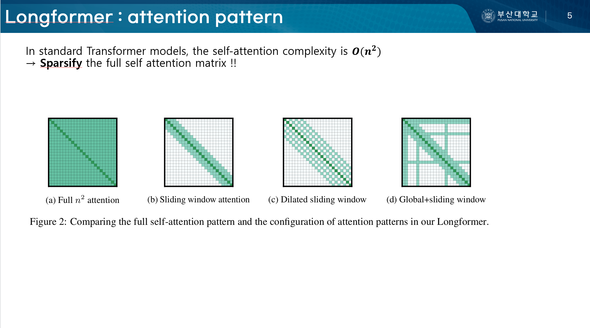

# Longformer Seminar

This repository contains the slides for a research seminar on **Longformer: The Long-Document Transformer**.

The seminar was presented at the **Machine Learning & Bioinformatics Lab, Pusan National University (PNU)** in 2025.

  

## Presenter

**Jiwon Lee**  
M.S. Student  
Machine Learning & Bioinformatics Lab  
Pusan National University

## Lab

Machine Learning & Bioinformatics Lab  
Pusan National University  

🔗 https://dmb.pusan.ac.kr/dmb/index.do

## Slides

📄 [View Slides](longformer.pdf)

## Description

This seminar introduces **Longformer**, a transformer architecture designed for efficient processing of long documents.

Standard transformers suffer from quadratic complexity with respect to sequence length. Longformer addresses this limitation using a **sparse attention mechanism**, combining:

- Sliding Window Attention
- Global Attention
- Linear scaling with sequence length

This architecture enables transformers to process sequences of **thousands of tokens efficiently**, making it suitable for tasks such as:

- Document classification
- Question answering
- Long-context language modeling

## Reference

Beltagy, I., Peters, M. E., & Cohan, A. (2020).  
**Longformer: The Long-Document Transformer**  
https://arxiv.org/abs/2004.05150

## Contact

If you find any errors or have questions regarding the material, please feel free to contact:

📧 jiwon_lee@pusan.ac.kr
